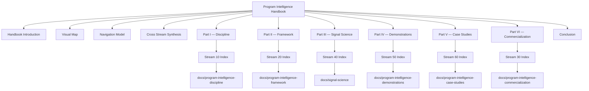
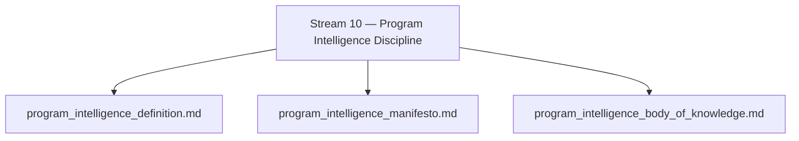
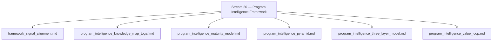
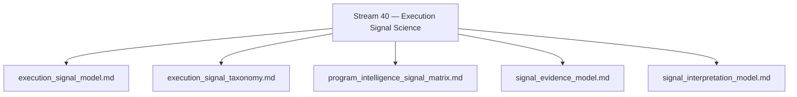
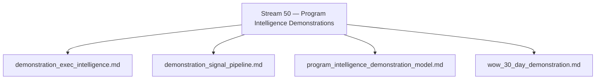
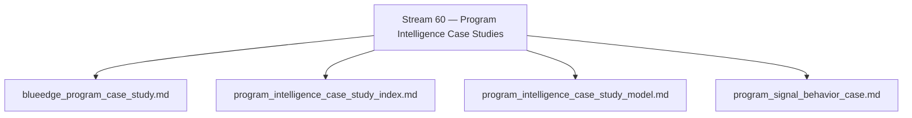
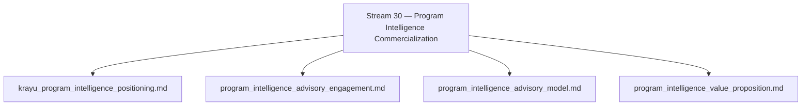

PROGRAM INTELLIGENCE HANDBOOK
Repository Structure Graph

Purpose

This document provides a visual representation of the Program Intelligence repository structure and the relationship between:

• the handbook navigation layer  
• handbook chapters  
• stream indexes  
• authoritative artifact directories  

The graph below illustrates how the handbook acts as the entry point into the discipline and how it connects to the underlying stream artifacts.

---

DISCIPLINE STRUCTURE GRAPH

---

DISCIPLINE FLOW

The Program Intelligence discipline transforms observable execution evidence into executive insight through the following conceptual chain:

Execution Evidence  
→ Execution Signals  
→ Signal Interpretation  
→ Program Intelligence  
→ Executive Insight

---

REPOSITORY PRINCIPLE

The handbook is the navigation layer of the discipline.

The authoritative content resides in the stream artifact directories.

The handbook must therefore:

• link to authoritative artifacts rather than duplicate them  
• provide conceptual synthesis of the streams  
• expose artifact indexes for each stream domain

---

MAINTENANCE RULE

When new artifacts are introduced:

1. The artifact is placed in the appropriate stream directory
2. The stream index is updated or regenerated
3. The handbook chapter is updated if conceptual synthesis is affected
4. The repository graph may be updated if structural changes occur

---

STREAM 10 — DISCIPLINE ARTIFACT GRAPH

---

STREAM 20 — FRAMEWORK ARTIFACT GRAPH

---

STREAM 40 — SIGNAL SCIENCE ARTIFACT GRAPH

---

STREAM 50 — DEMONSTRATIONS ARTIFACT GRAPH

---

STREAM 60 — CASE STUDIES ARTIFACT GRAPH

---

STREAM 30 — COMMERCIALIZATION ARTIFACT GRAPH

Maintenance Rule

Whenever a new artifact is introduced in a str